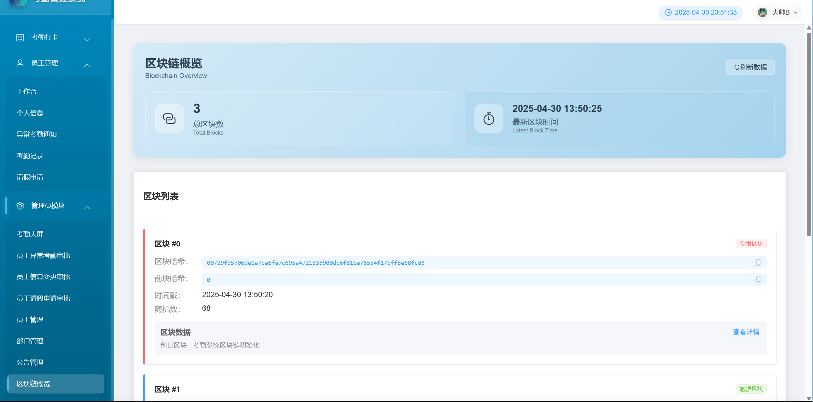
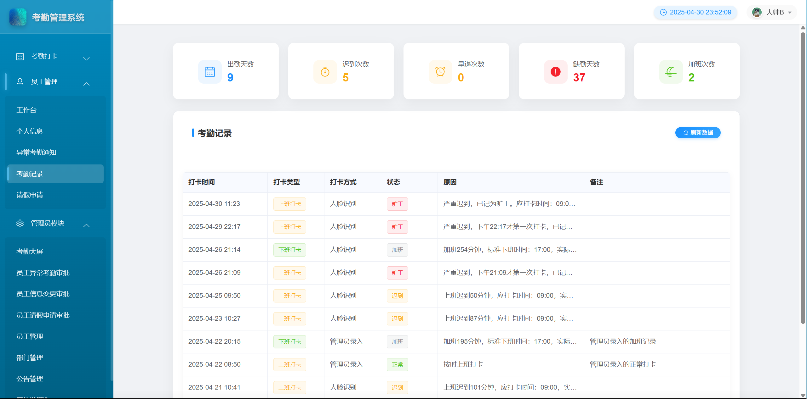

# 基于人脸识别和区块链的员工考勤系统

## 项目简介

这是一个基于Vue+Spring Boot实现的轻量级区块链考勤系统原型，用于记录和验证员工考勤数据。该系统完全不依赖现有区块链平台，而是从零开始实现了基本的区块链功能，确保考勤数据的不可篡改性和透明性。

## 功能特点

- **区块链核心技术**：
  - 基础区块链数据结构（区块 + 链）
  - 工作量证明(PoW)机制实现共识
  - SHA-256加密算法确保数据安全
  - 默克尔树结构用于高效验证数据完整性
  
- **业务功能**：
  - 员工考勤记录的添加与验证
  - 历史考勤数据查询与统计
  - 自动和手动触发区块生成
  - 直观的数据可视化界面

- **系统特性**：
  - RESTful API接口设计
  - 轻量级部署，无需外部区块链平台
  - 高安全性与数据一致性保障

## 技术栈

- Java 17
- Spring Boot 3.4.4
- Spring Data JPA
- H2内存数据库
- Lombok
- JUnit 5

## 系统架构

系统主要包含以下组件：

1. **区块结构**：每个区块包含区块头（哈希值、前块哈希、时间戳、nonce、默克尔根）和区块体（考勤记录数据）
2. **区块链**：管理区块的添加、验证和查询
3. **共识机制**：基于工作量证明(PoW)的简化实现
4. **数据存储**：内存存储，易于扩展到持久化存储
5. **RESTful API**：提供与区块链交互的接口

## 界面展示

### 登录界面

### 打卡界面

### 工作台界面

### 数据大屏

### 区块链概览

### 个人考勤界面

