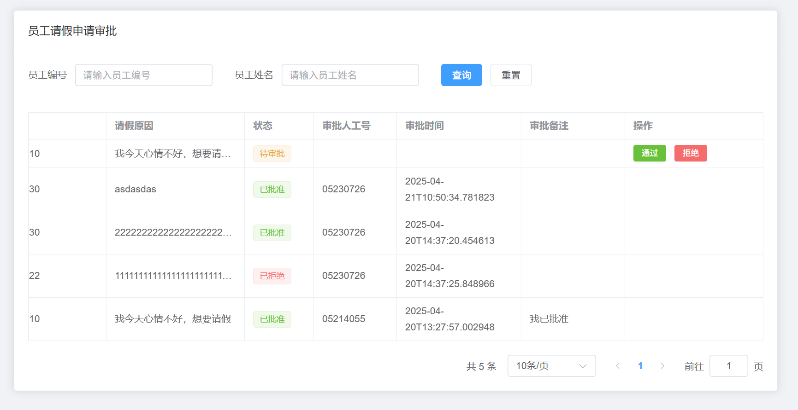
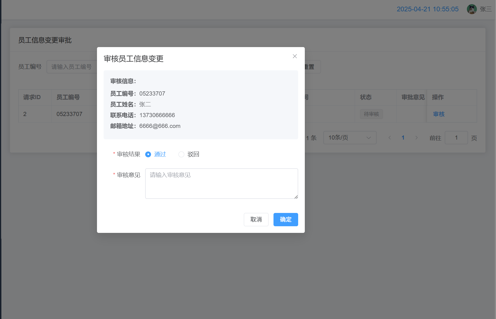
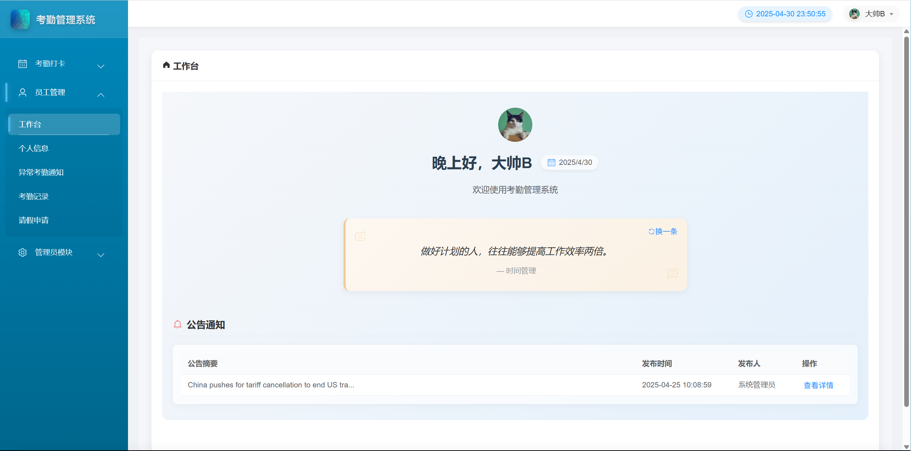
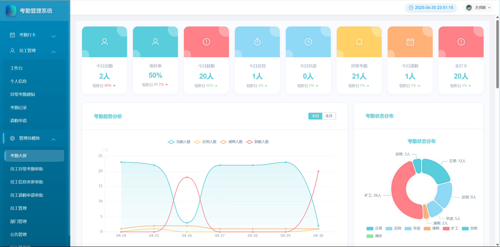

1. ✅将注册完界面放在登录界面，登录界面应该有返回打卡界面的按钮

2. ✅优化管理员判断，和用户登录，用户登录账号字段为employeeNo，是否为管理员字段：布尔变量 isAdmin ，true-是，false-否

3. ✅用户信息管理删除多余的，只保留以下字段

4. ```jason
   {
     "employeeNo": "05233707",
     "name": "张二",
     "phoneNumber": "13730666666",
     "email": "6666@666.com",
   }
   ```

5. ✅异常考勤通知界面删除【查看详情】按钮 ，优化页面展示样式

6. ✅添加考勤数据异常查看和申诉 

7. ✅已经完成人脸录入的员工，是否可以重新录入？
8. ✅【个人信息】界面需要新增按钮，重新录入人脸
8. ✅查询管理员是否通过异常考勤数据审核

8. ✅查询管理员是否通过异常考勤数据审核
9. ✅新增自动记录旷工功能 
10. ✅查询员工所有考勤数据
10. ✅ 【考勤申请】修改为【请假申请】
11. ✅ 建议【考勤记录】和【考勤统计】合并到一起
12. ❌【手动考勤】传入员工编号可以自行选择
13. ✅ 管理员可以审核自己的异常数据和请假申请，如何解决
14. ✅ http://localhost:8080/employee/info/update/pending 添加分页查询功能
15. ✅员工信息变更审核列表http://localhost:8080/employee/info/update/pending改为分页查询，增加一个employeeNo字段查询
16. ✅/employee/exception和/employee/record接口返回数据默认按照日期进行排序
17. ❌ （admin）员工请假申请没有填入审批理由，只有批准和拒绝
18. ❌ （admin）员工信息变更应该显示哪些地方做了更改。
19. ❌ 员工查询自己的考勤信息：/employee/record新增checkTimeStr字段，简化了时间格式，前端进行对应的修改
20. ❌ 前端问题，接口没问题
21. ❌前端改进：员工考勤记录添加加班次数统计
22. ❌数据大屏接口已提供返回字段参考md文档和swagger接口文档
23. ❌【员工列表】修改为【员工管理】，添加了四个接口，并删除【查看按钮】
24. 查看公告阅读情况 接口地址：GET http://localhost:8080/admin/announcement/read-status
当status没有值或者为正常值或者异常值，都不会返回任何信息，也不会返回报错信息